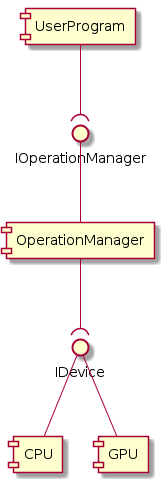
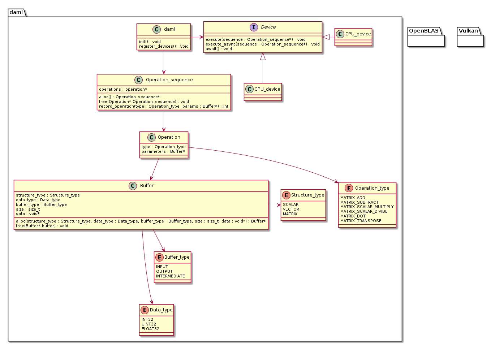

# Design

## Architectural overview

The general architecture makes use of two main components.
The OperationManager creates and manages jobs as instructed by the user program and allocates thesse to a device.
Furthermore there are different implementations for different types of the devices such as CPU's and GPU's that actually process the jobs.

## Class Diagram

