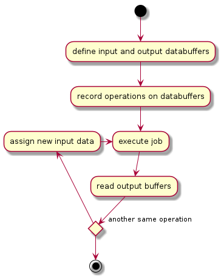

# Requirements

- An API for executing vector and matrix operations (MUST)
- Vector and matrix operations need to be able to be resolved on as many devices as possible including CPU's and GPU's (MUST)
- Operations are load balanced based on the available device performance (SHOULD)
- Devices can include networked devices such as in a cluster (COULD)

# Requirement analysis

## An API for executing vector and matrix operations (MUST)

### What operations need to be supported?

- Matrix scalar add
- Matrix scalar subtract
- Matrix scalar multiply
- Matrix scalar divide
- Matrix dot product
- Matrix transpose

### How should the execution pipeline function?

Since there will be devices that will have differing amounts of latency, operations should be recorded into a sequence of operations so sequential operations can be executed quickly in succesion. Lets call these sequences of operations jobs. These jobs should then be independently executed on a device and return a result. 

In the case of networked devices these operations should also be cached so only new data has te be sent and not the entire job.

As such the user would utilise the following steps to execute operations

## Vector and matrix operations need to be able to be resolved on as many devices as possible including CPU's and GPU's (MUST)

### With what API's can we support as many devices as efficiently as possible?

For CPU's OpenBLAS will be used and for GPU's a custom solution using vulkan will be used to ensure cross-platform support.

## Operations are load balanced based on the available device performance (SHOULD)

### How can the device performance for different operations be tested?

### How can the workload be devided over the different devices?

## Devices can include networked devices such as in a cluster (COULD)

### How can networked devices be discovered?

### How can the library communicate with the networked device?